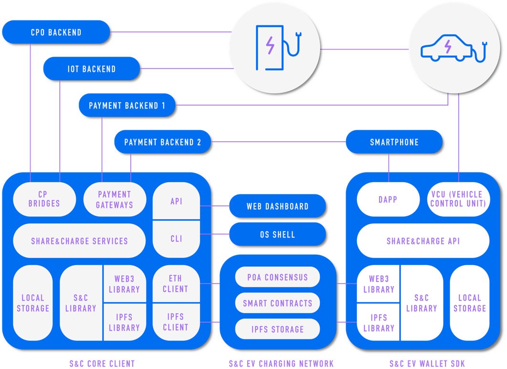

================================
High Level Architecture Overview
================================

.. :height: 500px
.. :width: 394px
   :scale: 50%
   :align: center

To cover all the different business cases and meet the requirements and needs that belong to the realm of EV charging, the **architecture** has to be designed to perform two main functions:

* Allow the **management of the charging infrastructure** by the different electric grid stakeholders (e.g. *Charge Point Operators* or *CPOs*)
* **Expose such charging infrastructure** to be used broadly in charging EVs around the world by the e-mobility actors (e.g. *Mobility Service Providers* or *MSPs*)

These ambitious functionalities need to be implemented following the properties that *Distributed Ledger Technologies (DLT)* and specially *Blockchain* technologies offer, like security by design, byzantine fault tolerance, decentralized consensus or immutability of the transactions and the execution of the code that is the basis of the system.

The ultimate goal of Share&Charge is to make its EV Charging Network the **authoritative central piece** where all the business logic is delegated to the code (i.e. "smart contracts") and the underlying related data is stored in a distributed way. Hence the challenge is being able to find the proper mechanisms that replicate all the **requirements** that CPOs and MSPs have in our software/hardware, and in parallel position our technology as the **de-facto standarised open source solution**.

Instead of providing monolithic black-boxed centralized solutions, our approach is to create tools that can be embedded, integrated, inserted in the current participants' infrastructure and ecosystem, and cohabit directly with the rest of the components running in their application stacks. In the engineering discipline, such design principles are called **"modularity"** or **"extensibility"**.
